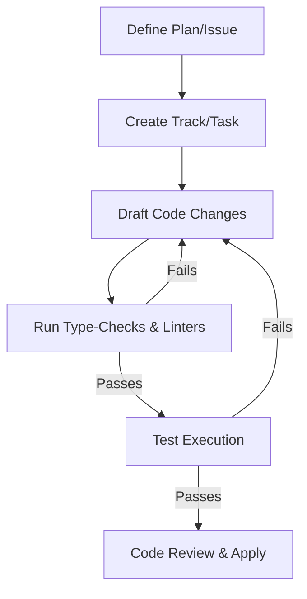

# Development Workflow: GodotCoder

This document details the development conventions, quality gates, and agent workflow standards for building and updating the GodotCoder project.

## Development Lifecycle

1. **Planning**: Use `conductor/tracks.md` to register feature development tracks.
2. **Implementation**: Code changes must follow structured design patterns in TS/Node and respect existing module scopes.
3. **Type-Checking & Build validation**:
   - Run type-checks: `npm run check`.
   - Run build: `npm run build`.
4. **Git Commit Conventions**:
   - Use conventional commit messages (e.g., `feat: add validation command`, `fix: repair script regex`).
   - Keep commits granular and scoped to a single logical task.

## Code Quality Standards
- **Strong Typing**: Avoid using the `any` type. Define interfaces or types for LLM outputs, parser returns, and CLI options.
- **Safety Boundaries**: File paths must be strictly checked to prevent escaping the project workspace root.
- **Documentation**: Write inline documentation and JSDoc tags for core functions, especially in the provider abstractions and repair patterns.
