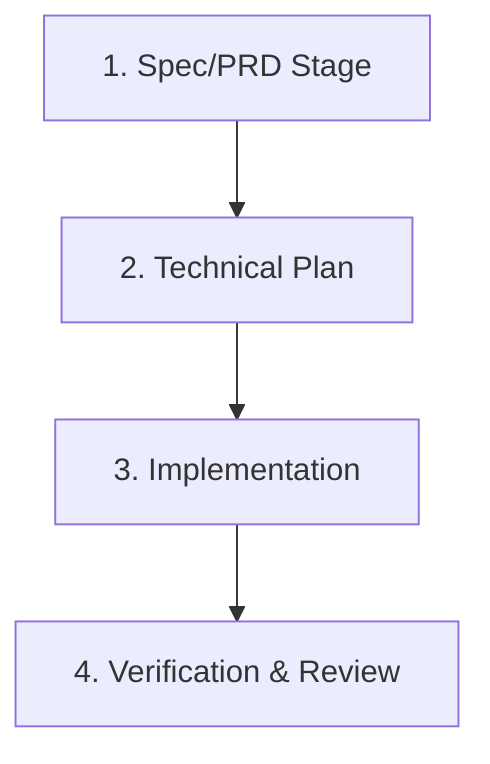

# Conductor Development Workflow

This project utilizes Conductor mode, which structures development into clear phases, automatically assisted by oh-my-gemini hooks.

## Workflow Phases

### 1. Spec & PRD Phase
- **Goal:** Define what to build.
- **Artifact:** A track feature specification under `conductor/tracks/`.
- **Gate:** Alignment on goals, inputs/outputs, and edge cases.

### 2. Planning Phase
- **Goal:** Design the technical approach.
- **Artifact:** Technical Plan (`conductor/tracks/<feature>/plan.md`).
- **Gate:** Code design review and listing modified files.

### 3. Implementation Phase
- **Goal:** Write clean code.
- **Process:** Edit code files incrementally. 
- **Gate:** oh-my-gemini hooks automatically create git checkpoints before file edits, allowing safe rollbacks.

### 4. Verification & Review Phase
- **Goal:** Ensure code is correct and meets style guidelines.
- **Auto-Verification Hook:** Runs `npm run check` and `npm run test:smoke` automatically on tool execution completion.
- **Manual Review:** Run `/omg:review` to generate a diff and review summary.
